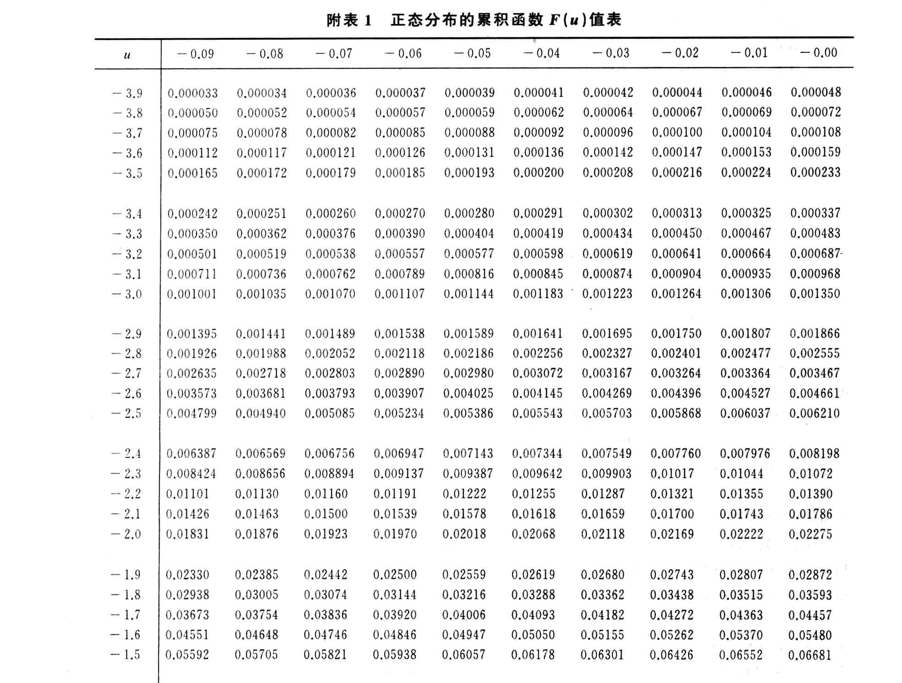
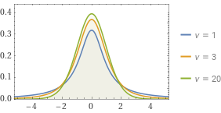
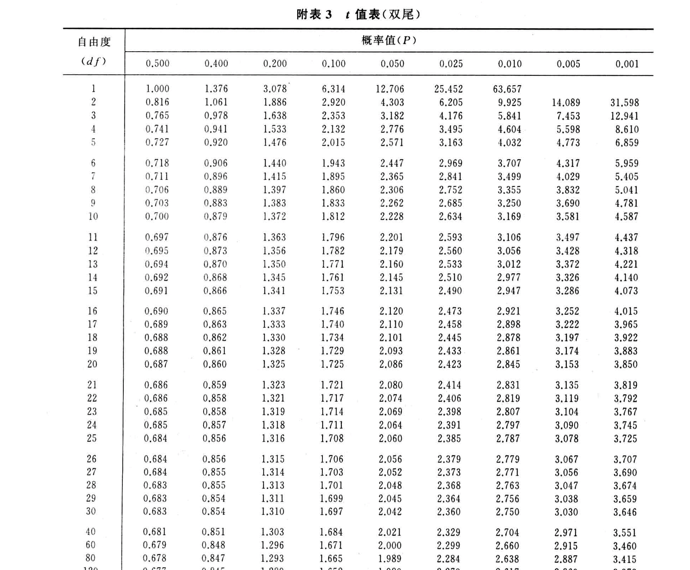

（封面与文章无关）

`Alice`正在愉快的玩耍，这时她遇到了一些问题

## 二项分布

`Alice`有 $n$ 个灯泡，其中每一个打开的概率均为 $p$，相反关闭的概率均为 $q$，现在问题来了，`Alice`（为什么又是她）想要知道其中 $m$ 个开关同时打开的概率 $P(m)$ 为多少

显然这个问题是非常容易解决的。每个开关只能处在打开或关闭两种状态中的一种，那么既然 $m$ 个打开，剩下 $n$ 个则必然关闭，让我们来看看，这种情况下的概率显然是 $p^mq^{n-m}$，但这就是全部可能了吗？考虑以下情况，两个并排的开关可以处在 `开关` 的状态，亦可以处在 `关开` 的状态，这显然算两种。因此，我们不仅要考虑**有**$m$ 个开关打开，亦要考虑**哪**$m$ 个开关打开。对于后者，可以使用**组合**来处理，即从 $n$ 个开关中抽 $m$ 个打开。

最终，我们可以得到 $P(m)=\mathrm{C}_{n}^{m}p^mq^{n-m}$，这即是二项分布。

为了简化使用，我们将二项分布记作 $B(n,p)$，这个函数的图象类似于下图 ![[Pasted image 20240721213534.png]]

### 一些扩展

`Alice` 可不仅仅满足于此，她和 `Bob`（哦！天呐）研发了一种特殊的开关，现在它不仅可以开关，还可以既开又关了，对于这种有三个状态的开关，又该怎么计算呢？

让我们假设有 $s$ 个开关打开，$t$ 个开关关闭吧，暂且不考虑既开又关的开关。显然 $P(s)=\mathrm{C}_n^sp^sq^t$，如果稍稍化简可以得到 $P(s+t)=\frac{n!}{s!\times{t!}}p^sq^t$。凭借惊人的注意力，你应该可以注意到，如果我引入了既开又关的开关后，概率的表达式可以写作 $P(s+t+u)=\frac{n!}{s!\times{t!\times{u!}}}p^sq^tr^u$，事实上的确如此。

当然，如果有一天 `Alice` 发明了更加抽象的开关，它依然可以用类似的方法来计算

## 泊松分布

毕竟那可是 `Alice` 与 `Bob`！没有什么是他们干不出来的。

事情逐渐抽象了起来，`Alice` 用 LED 灯带替换掉了原来的白炽灯。现在可不再是 n 个开关了，而是一整条灯带！`Alice` 使用原力（？）让 LED 灯带中的**很少的**点亮起来，不过原力有限，平均下来 `Alice` 只能让 $\mu$ 个点亮起来。`Alice` 依然想知道她让 $k$ 个点亮起来的概率。

额，似乎有些麻烦。不过没关系，让我们先看看简单点的情况。如果这条灯带有 $n$ 个点构成，我们依然可以用**二项分布**来解决

$$

P(x=k)=\mathrm{C}_n^mp^mq^{n-m}

$$

但是拜托，这可是 LED 灯带欸，它可有很多很多个点，或者说……无穷多个？

对啦！那么现在我们就可以写出这个式子

$$

\begin{align}
P(x=k)=&\lim_{n\rightarrow\infty}\mathrm{C}_n^mp^mq^{n-m}\\
=&\lim_{n\rightarrow\infty} \frac{n!}{\mu!(n-\mu)!} {\frac{\mu}{n}}^\mu(1-{\frac{\mu}{n}})^{n-\mu}\\
\end{align}

$$

使用一些超纲的知识，我们最终可以知道

$$

\begin{align}
P(x=k)=\frac{\mu^k}{k!}e^{-\mu}
\end{align}

$$

稍稍修改一下，把 $\mu$ 换成 $\lambda$

$$

\begin{align}
P(x=k)=\frac{\lambda^k}{k!}e^{-\lambda}
\end{align}

$$

这即是泊松分布的表达式

## 正态分布

无所不能的 `Alice` 又有了更多的问题，在刚刚的情况下，`Alice` 还想知道有 $k$ 个点不亮的概率。

嗯？这看上去还是一样的欸。但是，在刚刚的情况下，只有**很少**的点是亮的，而不亮的点却**非常多**，而这会带来非常大的困扰。二项分布仅仅只在**离散**的情况下适用，在刚刚点很少时，我们可以将它们看作 $n$ 很大的离散变量（事实上我们也的确是这样做的）。不过现在要考虑的点非常多，我们再也不能将它们看作离散的了，它们应当是**连续变量**。

那么，怎么办呢？

没事，我们还有 `Bob`！刚刚学完概率学的 `Bob` 告诉我们，对于**连续随机变量**，它们应当满足大名鼎鼎的 **~~正太~~正态分布**。

`Bob` 还非常好心的告诉了我们正态分布表达式，因为这超出了我们所能推导的范围

$$

f(x)=\frac{1}{\sigma\sqrt{2\pi}}e^{-\frac{(x-\mu)^2}{2\sigma^{2}}}

$$

那，这又代表了什么呢？

首先，正态分布的图像是一个**概率密度曲线**。相比于一般的概率分布函数，它最大的特点是**连续曲线**，这也就意味着，我们可以通过积分的方式，求出**一段区间**的概率，而这是概率分布函数所不能的（拜托，人家都不连续，求区间概率有什么用啊）

其次，式中的 $\sigma$ 指的是总体中的标准差，在此处的情景下，它指的是整条 LED 灯带上，不亮的点的数量的方差。你可能会疑惑，为什么会有这个方差呢？别忘了 `Alice` 并不能确保每次点亮的点数量不变

然后 $\mu$ 呢？这是总体平均数，对象仍然是整条 LED 灯带上不亮的点，不过这次求的是平均数。

好啦，现在你已经明白了正态分布的函数与什么有关，类似于二项分布，让我们将它写作 $N(\mu,\sigma^2)$，来看看它的图像吧 ![[Pasted image 20240721221238.png]]

### 更进一步

`Alice` 现在终于满足了，不过她仍然想要继续研究一下如此有趣的正态分布，因此她提出了几个问题

1. `Bob` 说用它可以计算区间概率，该怎么算呢？
2. `Bob` 好像说过要用积分，但是我不会欸，可以不用吗？
让我们一步一步来，对于第一个问题，我们只需要把这整个区间内的概率加起来，也就是说
$$
P(a<x<b)=\int_a^bf(x)\mathrm{dx}
$$

`Alice` 面漏难色，她说她不会积分，让我们试试用其他方式。

嗯，好吧。也许我们可以帮她提前算出来。让我们定义正态分布的**概率累积函数**，也就是把 $u$ 之前的概率全部累积起来

$$
F(u)=\int_{-\infty}^uf(x)\mathrm{dx}
$$

这样的话，我们就能稍稍偷点懒呐。

$$
\begin{align}
P(a<x<b)&=\int_a^bf(x)\mathrm{dx}\\
&=\int_{-\infty}^bf(x)\mathrm{dx}-\int_{-\infty}^af(x)\mathrm{dx}\\
&=F(b)-F(a)
\end{align}
$$

`Alice` 有疑问了，正态分布 $N(\mu,\sigma^2)$ 可是有两个变量诶，难道对于每一个组合，我都需要重新计算 $F(u)$ 吗？

确实，`Alice` 的疑问不无道理。也许我们可以……只算一个，尽可能把其它情况套上来？试试就试试。

首先我们得挑一个 $F(u)$ 来算，干脆就算 $N(0,1)$ 时的 $F(u)$ 吧！这时应该是一个比较特殊的情况。

接下来有了 $F(u)$，我们得开始思考怎样用它来表示所有。假设我们现在有一个正态分布 $N(\mu,\sigma^2)$，让我们尝试把它变成 $N(0,1)$。平均数 $\mu$ 应该是比较好处理的

$$
\begin{align}
\mu&=\frac{\sum\limits x}N\\
\mu-\mu&=\frac{\sum\limits x}N-\mu\\
0&=\frac{\sum\limits x-N\mu}N\\
0&=\frac{\sum\limits (x-\mu)}N
\end{align}
$$

这就是说，我们只需要让总体中的每一个元素减小 $\mu$ 就行。接下来就该方差 $\sigma^2$ 了

$$
\begin{align}
\sigma^2&=\frac{\sum\limits((x-\mu)-\mu)^2}{N}\\
\frac{\sigma^2}{\sigma^{2}}&=\frac{\sum\limits((x-\mu)-\mu)^2}{N\sigma^2}\\
1&=\frac{\sum\limits(\frac{{(x-\mu)-\mu}}{\sigma})^2}{N}\\
\end{align}
$$

很棒，$\mu$ 和 $\sigma^2$ 都搞定了, 让我们回过头看看我们都对 $x$ 做了什么，把它减个 $\mu$ 再除个 $\sigma$，也就是 $\frac{x-\mu}{\sigma}$。最后得到的这个式子可以直接带进 $N(0,1)$ 的概率累积函数。看上去我们的操作会影响它的结果？其实不会，我们只改变了 $x$ 的大小，并没有影响它们的分布，所以概率是不变的。这意味着很关键的一点

$$
F_{N(0,1)}(u=\frac{{x-\mu}}{\sigma})\Leftrightarrow F_{N(\mu,\sigma^2)}(x)
$$

因此，我们称刚刚的操作为**正态分布标准化**，$u=\frac{{x-\mu}}{\sigma}$ 为**标准正态离差**，而 $N(0,1)$ 则是**标准正态分布**。

现在，我们就可以进一步简化之前的式子

$$
\begin{align}
P(a<x<b)&=F_{N(\mu,\sigma^2)}(a)-F_{N(\mu,\sigma^2)}(b)\\
&=F_{N(0,1)}(\frac{a-\mu}{\sigma})-F_{N(0,1)}(\frac{b-\mu}{\sigma})
\end{align}
$$

有了这个式子之后，我们只需要再配上一张 $F(u)$ 值表就可以轻易求得我们想要的区间概率

## t 分布

在学习了正态分布过后，`Alice` 信心满满的开始了实践，她想对一些样本进行计算 $N(\mu_{\overline x},\sigma_{\overline x}{}^2)$。好景不长，刚开始她就遇到了一个致命的问题。正态分布 $N(\mu_{\overline x},\sigma_{\overline x}{}^2)$ 中的 $\sigma_{\overline x}{}^2$ 是**所有可能的样本**的方差，可是，我们怎么知道呢？`Bob` 告诉 `Alice`，不知道的话也可以用 $\sigma^2/n$ 计算，可是，我们还是不知道啊！

`Alice` 看了看手上的数据，似乎**已知样本**的方差 $s^2$ 可以代替 $\sigma^2$，不过式子得稍稍修改一下成 $N(\mu_{\overline x},{s^2/n})$。但她也清楚的知道，这样做的话，在**样本容量**较小的时候误差会很大。怎么办呢？`Bob` 突然想起来，这个问题前人也有研究过，并且提出了解决方案——$t$ 分布

让我们来看看吧！首先，按照刚刚的思路，我们改变了一下正态分布的参数，这也就意味着我们的标准化也有了变化。

$$

\begin{align*}
u&= \frac{\overline x-\mu_{\overline x}}{\sigma/\sqrt{n}}\approx\frac{\overline x-\mu_{\overline x}}{s/\sqrt{n}}
\end{align*}

$$

注意到只有当 $n$ 较大时（通常以 $30$ 为界）约等号才成立，在较小时则不成立。那，它又等于什么呢？干脆直接起名叫 $t$ 吧！

按照 Gosset 的理论，其实 $t$ 也满足特定的分布，也就是 $t$ 分布。
$$

f(t)=\frac{{\Gamma(\frac{{df+1}}{2})}}{\sqrt{\pi df}\Gamma(\frac{df}{2})}(1+\frac{t^{2}}{df})^{\frac{-df+1}{2}}

$$
哇，好复杂！别慌，让我们看看，整个式子里除了 $t$ 以外，就只有 $df$ 一个参数。$df$ 即是**自由度**，指在一定约束条件下，可以自由取值的变量的个数。来看看图吧（图中 $v$ 即指自由度）！
嗯？长的好像正态分布。事实上，当 $df\rightarrow\infty$ 时，$t$ 分布趋近于正态分布。
OK，问题解决了！不过当 `Alice` 兴致冲冲去找 $t$ 分布的标准表时，她却只找到了一个叫 **$t$ 值表（双尾）** 的东西。
嗯？这是什么？为什么它只能用概率去查 $t$？`Alice` 百思不得其解。`Bob` 这时提醒她，因为这张表是用来**验证**的，而大家平时一般不会用 $t$ 去算概率（好吧）。
不过，这张表到底怎么用呢？详见下回分解🐶