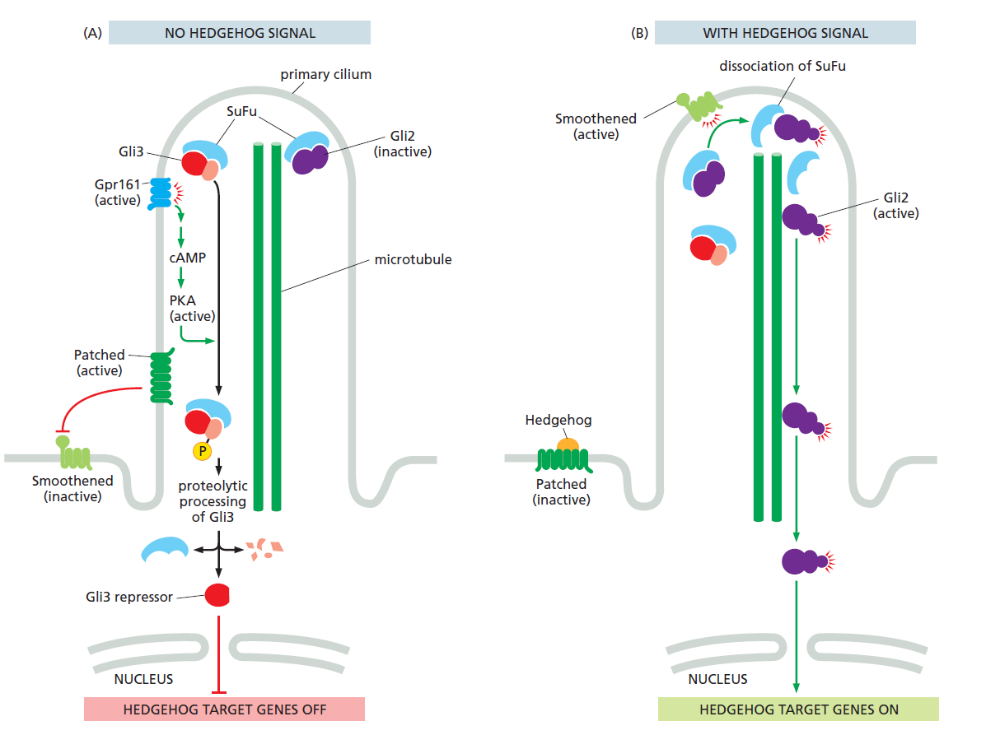
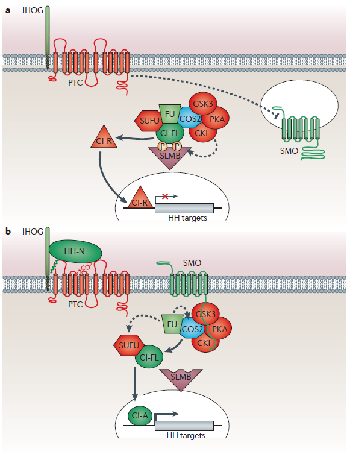
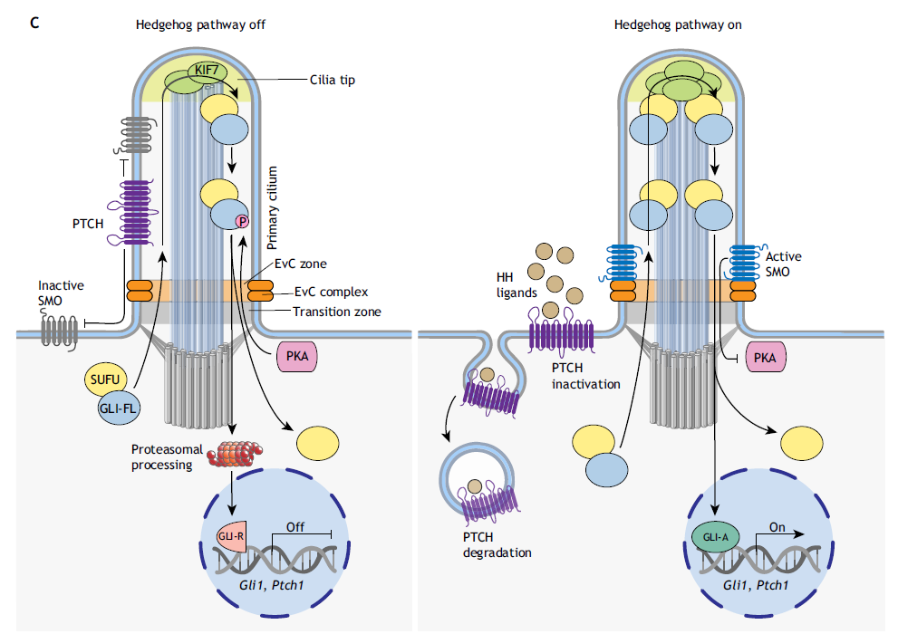

## 问题的开始
在丁明孝先生等编著的《细胞生物学》第五版上，对于Hedgehog信号通路进行了叙述。奈何书上的描述实在是过于晦涩，笔者不得不转向其他书籍。

但是，在Alberts的 *Molecular biology of the cell* 上，讲述了一种同《细胞生物学》第五版中几乎完全不一样的转导方式，除了部分蛋白如 **Ptc** 和 **Smo** 对应的上，其他部分是差异极大

如图，根据Alberts的说法，Hedgehog通路需要纤毛的参与，且**Smo**失活后仅仅是从纤毛上转移下来；但在《细胞生物学》第五版中，**Smo**失活后会被囊泡内化，且整个转导过程中完全没有纤毛的参与（虽然有微管参与）

事已至此，笔者决定一探究竟

## 收集资料
首先，笔者找到了Wikipedia上的[Hedgehog条目](https://zh.wikipedia.org/wiki/%E5%88%BA%E7%8C%AC%E4%BF%A1%E5%8F%B7%E9%80%9A%E8%B7%AF)，它虽然并没有对具体的转导通路进行讲解，但是提供了很重要的一点：果蝇和脊椎动物的Hedgehog信号通路似乎不太一样。

根据这点，笔者再回头看了看书，发现Alberts也明确提到了书中所讲的是脊椎动物中的信号通路，《细胞生物学》上虽然没提，但想必应该不是脊椎动物。

进一步，笔者查询脊椎动物中的Hedgehog通路，找到了来自*Development* 的一篇文献，文献中所描述的通路与Alberts讲述的别无二致

再以无脊椎动物的hedgehog通路进行查询，找到了 *Nature Reviews Genetics* 的一篇综述 *Mechanisms and functions of Hedgehog signalling across the metazoa*，根据综述中所讲内容，在整个后生动物中，其实Hedgehog通路是在不断发生改变的，但可大致分为两类：以黑腹果蝇为代表的形成 **COS2** 复合物的途径，以及脊椎动物中的依赖纤毛富集信号蛋白的途径

果蝇中，**COS2** 复合物的作用是切割全长 **CI** 蛋白，形成转录抑制物 **CI-R**（即《细胞生物学》中 **Ci75**），**Smo** 则会在活化后阻止复合物形成，致使 **CI-FR**得以进入细胞核，形成转录因子 *CI-A**，激活下游基因（关于《细胞生物学》上说复合物的组装需要微管这件事，尚不清楚是否为真，综述中只提到了 **COS2** 有类马达蛋白结构域，这可能也是书中认为有微管参与的原因）

而在脊椎动物中，转录因子依旧是由 **Smo** 激活，但是是在被转运到纤毛中后完成的。**Smo** 磷酸化抑制蛋白 **SuFu**，致使其解离而实现

## 结论
两本书中的叙述都没错，不过是两种不同的动物具有不同的形式罢了

## 补充：胆固醇
《细胞生物学》上有一点没有讲，就是胆固醇在Hedgehog通路中的作用。

**Ptc** 是一个胆固醇转运蛋白，它会将胆固醇转运出膜外，而恰好 **Smo** 的活化是依赖胆固醇的。因此通常情况下，**Ptc**会阻断 **Smo** 的活化。

**HH**（aka **iHog**）的作用便是阻断 **Ptc** 的作用，从而使得 **Smo** 得以活化。这也是一种非常特殊的作用方式

## 参考文献

1. Ingham, Philip W., Yoshiro Nakano和Claudia Seger. 《Mechanisms and Functions of Hedgehog Signalling across the Metazoa》. Nature Reviews Genetics 12, 期 6 (2011年6月): 393–406. https://doi.org/10.1038/nrg2984.
2. Kong, Jennifer H., Christian Siebold和Rajat Rohatgi. 《Biochemical mechanisms of vertebrate hedgehog signaling》. Development (Cambridge, England) 146, 期 10 (2019年5月15日): dev166892. https://doi.org/10.1242/dev.166892.
