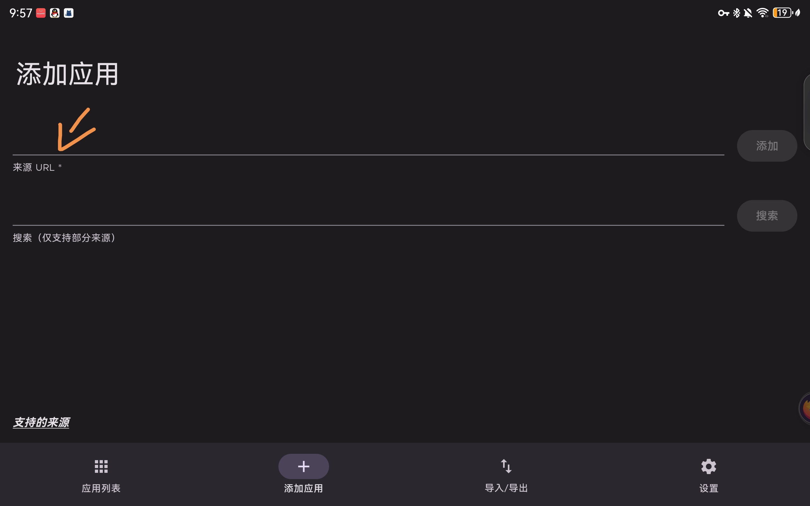

## 准备
在按照本食谱食用之前，请确保您已准备好***魔法***，本食谱中部分操作需要使用魔法
（什么？你是麻瓜？也许你可以试着去问问作者）
## 找书
作为一名生竞生，许多时候需要用到各种教材的电子版，但是却苦于找不到，本部分将教会您如何正确的找书。
### 来源
#### [zlibrary](https://singlelogin.re)
作为全世界最大的电子书收集站，zlib甚至还得到了官方认证~~（狗头）~~，因此，你想找的书大部分在这里都能找到，下载速度也不错
#### [Anna's Archieve](https://annas-archieve.org)
安娜的档案原本是原本是一个zlibrary的镜像站，但后来逐渐加入了一些别的资源，因此会有部分在zlib上找不到或下不了的书，并且还并入了Sci-Hub的资源，因此十分方便。唯一需要注意的是它的Fast Download仅供赞助用户（大概一个月三十）使用，有一点小贵
## 论文
相信各位都会去找论文来看吧！学过生物信息学过后，大家肯定都知道了PubMed，当然还有Google Scholar。但是PubMed只提供搜索服务，又该如何下载呢？
### Free
假如你运气足够好，想要下载的论文是免费的，你只需要在PubMed上找到Full text link，然后在论文原网站下载PDF即可
### Paid
万一你运气不够好呢？
#### 什么是 `DOI`
`DOI`是数字对象唯一识别符，用来唯一地标记对象。相应的，每一篇论文都有其独一无二的 `DOI`。例如，`CRISPR-Cas9`原论文的`DOI`是`10.1038/nprot.2013.143`。在网站上，出版社都会给出论文的 `DOI`，大多数时候是这样的链接：`https://doi.org/10.1038/nprot.2013.143`。
#### And the next?
拿到 `DOI`后，你就可以用它在[Sci-Hub](https://sci-hub.st)上寻找该文章了。当然，你也可以在Annas Archieve上下载。注意，假如这篇文章是最近发表的，有可能在Sci-Hub上找不到。
## 搜索
众所周知，百度是最难用的搜索引擎之一。因此，强烈建议使用Google或DuckDuckGo或Bing（按推荐度排列）代替百度。
### 关于百科
百度百科以及一众国产竞品因为编辑门槛过低，内容审核不行，充斥着一众垃圾条目。因此，强烈建议使用Wikipedia代替。请注意，部分条目暂时缺少中文版，这种情况请参考其他语种，如有必要请使用翻译。
### 关于知乎
知乎作为一个问答社区，还是有许多高质量内容的，但无奈于知乎的搜索做的实在是太差了，请不要使用知乎自带的搜索，转而使用搜索引擎，在搜索结果中挑选来自知乎的内容，对于优秀的答主，请不要吝惜你的关注和赞同。
### 关于AIGC
在很多时候，`ChatGPT`，`Bard`等 `AIGC` 模型可以代替搜索引擎，但请牢记，AI是会犯错的，它很可能会一本正经的胡说八道还迷之自信，所以请务必核实。
## PDF
假如你只需要简单的高光、划线，例如阅读教材的时候，请无脑选择Acrobat！作为Adobe的亲儿子，Acrobat对PDF的渲染，加载速度，兼容性还有UI绝对是最优秀的，唯一的不足是手绘功能太鸡肋，以及部分功能付费（但基础功能绝对够用）。
但如果你需要做笔记，绘图，还请选择更专业的笔记软件，例如华为自带的笔记。
## 笔记
### 手写笔记
很抱歉这超出了作者的涉猎范围，还请自行寻找合适的软件
### 仅打字
请明确一个原则，内容才是最重要的，不要过于看中排版。因此，Word等一众富文本软件并不适合记笔记，更好的选择是使用[Markdown](https://markdown.com.cn/intro.html#markdown-%E6%98%AF%E4%BB%80%E4%B9%88%EF%BC%9F)
对于安卓用户，Obsidian和Notion会是不错的选择，Notion的功能会更加丰富，但注意Notion的数据保存在云端，需要时刻联网。
对于PC用户，Obsidian依然可用，但Typora也会是很不错的选择。除非你知道这是什么，请不要轻易选择Visual Studio Code。
## 浏览器
别用国产！别用国产！别用国产！
推荐使用Firefox（国际版），Edge或Chrome（按推荐度排序）
（并没有夹带私货，但为了不让Chromium一统天下，还是支持支持Firefox吧！）
### Firefox Add-ons
Firefox在安卓端依然支持使用部分插件，虽然适配的数目不多，但是tampermonkey可！以！用！所以，可以通过安装油猴脚本的形式来使用插件的插件，以实现网页自动翻译，广告屏蔽，视频下载等功能。
## FAQ
### 我该如何下载提到的这些App？
你可以在[Apkpure](https://apkpure.net)上搜索应用并下载，并使用Obtainium（[下载链接](https://github.com/ImranR98/Obtainium/releases/latest)）实现自动更新，仅需要将Apkpure的链接（形似 `https://apkpure.net/youtube/com.google.android.youtube`）简单的粘贴到来源链接中，点击添加

### 论文/书籍/......下载失败
请使用[Aria2App](https://github.com/devgianlu/Aria2App/release/latest)下载，该软件依然可以用Obtainium自动更新，同样的复制链接并粘贴即可
注意，Obtainium可能会提示你使用 `Github Token`，这种情况请从Apkpure上找到这个应用，并更换为Apkpure上的链接。（或者咨询作者）
### Firefox国际版从哪下？
Apkpure，见上。
### 可是我用Windows诶？
大差不差，只是你不能再使用Aria2App和Obtainium，请使用Aria2NG和winget替代，你也不再需要Apkpure。
（什么？你不会用？请私信作者~~单独辅导~~寻求帮助）
### 可是我用Linux欸？
都用Linux了还要我教什么？
### 可是我用IOS/MacOS欸？
尊贵的苹果用户不需要这些
## 补充
待更新